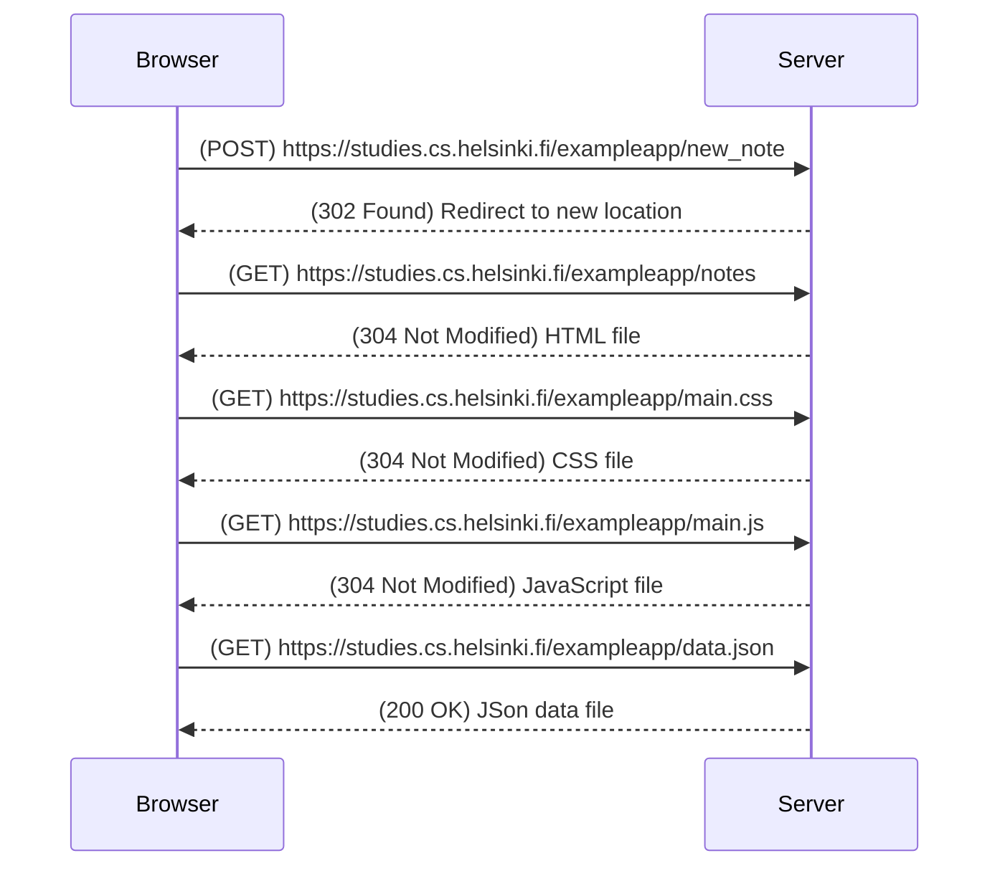

```mermaid
    
    sequenceDiagram
        participant Browser
        participant Server

    Browser->>Server: (POST) https://studies.cs.helsinki.fi/exampleapp/new_note

    Server-->>Browser: (302 Found) Redirect to new location
    
    Browser->>Server: (GET) https://studies.cs.helsinki.fi/exampleapp/notes
    
    Server-->>Browser: (304 Not Modified) HTML file
    
    Browser->>Server: (GET) https://studies.cs.helsinki.fi/exampleapp/main.css
    
    Server-->>Browser: (304 Not Modified) CSS file

    Browser->>Server: (GET) https://studies.cs.helsinki.fi/exampleapp/main.js
    
    Server-->>Browser: (304 Not Modified) JavaScript file

    Browser->>Server: (GET) https://studies.cs.helsinki.fi/exampleapp/data.json
    
    Server-->>Browser: (200 OK) JSon data file

```